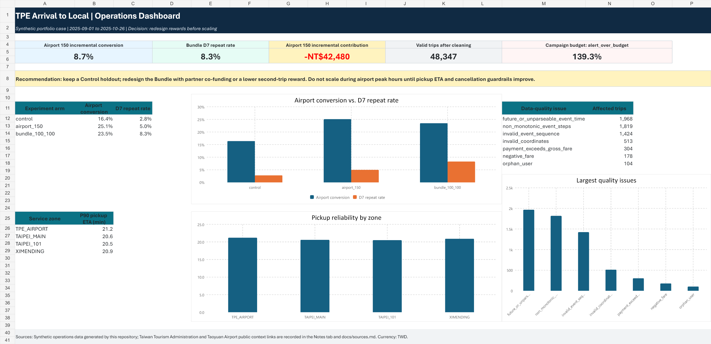

# From Dirty Ride Data to Operations Decisions

## An Airport Travel Partnership SQL Case Study

An independent, synthetic-data portfolio project about ride-hailing platform operations. The case asks how an airport travel partnership should target inbound travelers, select rewards, and protect marketplace health.

**Website:** [Explore the plain-language Traditional Chinese report](https://joelyn-poh.github.io/taiwan-airport-ops-case-study/)

**Professional English version:** [Open the operations evidence portfolio](https://joelyn-poh.github.io/taiwan-airport-ops-case-study/portfolio/)

> **Business question:** With a fixed eight-week budget, which arriving travelers should receive which airport reward in order to create incremental trips and contribution without harming pickup reliability?



## What this project demonstrates

- SQL data cleaning for duplicate, late, malformed, inconsistent, and orphaned ride-hailing records.
- Cohort selection using CRM consent, partner-booking, trip-history, and promotion-eligibility rules.
- Intent-to-treat campaign measurement: conversion, repeat trips, incremental contribution, and reward cost.
- Marketplace guardrails: ETA, cancellation, acceptance, and hourly demand-supply gap.
- An Excel dashboard plus launch and monitoring playbooks for cross-functional execution.

## Project flow

```text
Synthetic raw ride data -> SQL quality checks -> clean trip lifecycle
-> campaign and marketplace marts -> Excel dashboard -> operating recommendation
```

Raw data is intentionally imperfect. The cleaning workflow never overwrites raw records; it standardizes types, keeps the earliest duplicate receipt, quarantines hard-invalid records, and retains plausible outliers with a flag. `data/public/market_context_assumptions.csv` is a documented background appendix, not an input to the campaign calculations.

## Key outputs

| Output | Purpose |
|---|---|
| `sql/` | Reproducible DuckDB SQL transformations and business analysis |
| `tests/` | Data-quality and business-rule checks |
| `dashboard/airport_campaign_dashboard.xlsx` | Stakeholder-ready Excel dashboard |
| `docs/` | Data model, cleaning rules, metric definitions, campaign and operational documents |

## Reproduce locally

```powershell
python -m pip install -r requirements.txt
npm install
python src/generate_synthetic_data.py --mode sample
python src/run_pipeline.py
node src/build_dashboard.mjs
```

The project uses Python 3.12, DuckDB, Node.js 20+, and `@oai/artifact-tool` for the Excel workbook. If this package is unavailable outside Codex, run the SQL pipeline and review the exported CSV marts; the Dashboard is a reproducible presentation layer, not the source of truth. The generated source data is deterministic through `config.json`.

## Data and ethical note

All operational records are synthetic. Market context sources and their limitations are documented in [docs/sources.md](docs/sources.md). See [DISCLAIMER.md](DISCLAIMER.md) before interpreting the findings.

## Repository map

```text
data/       raw synthetic sample, source notes, and data dictionary
src/        generator, pipeline runner, and dashboard builder
sql/        staged, cleaned, and analytical SQL layers
tests/      reproducible SQL assertions
outputs/    small, derived metrics exported by the pipeline
dashboard/  Excel dashboard and preview image
docs/       business and operating documentation
```

---

中文說明請見 [README_zh-TW.md](README_zh-TW.md)。
