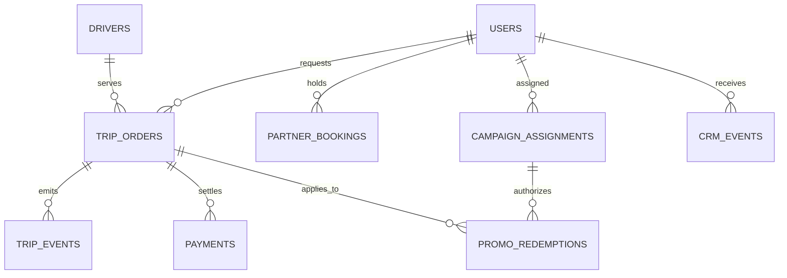

# Data Model

## Layering

| Layer | Objects | Rule |
|---|---|---|
| Raw | `raw_*` tables | Immutable landing layer; intentionally includes quality problems. |
| Staging | `stg_*` tables | Type conversion, standardization, source-level de-duplication. |
| Intermediate | `int_*` tables | Event sequencing and trip-lifecycle reconstruction. |
| Fact / dimension | `fct_*`, `dim_*` | One trusted grain per entity. |
| Mart | `mart_*` tables | Campaign, finance, marketplace, and quality decisions. |

## Grain and key fields

| Table | Grain | Key fields |
|---|---|---|
| `raw_users` | One user profile version | `user_id`, `ingested_at` |
| `raw_drivers` | One driver profile version | `driver_id`, `ingested_at` |
| `raw_partner_bookings` | One partner-arrival booking | `booking_id` |
| `raw_trip_orders` | One client trip creation attempt | `trip_id`, `ingested_at` |
| `raw_trip_events` | One status event receipt | `event_id` |
| `raw_payments` | One payment or refund event | `payment_id` |
| `raw_campaign_assignments` | One campaign allocation receipt | `assignment_id` |
| `raw_promo_redemptions` | One applied promotion receipt | `redemption_id` |
| `raw_crm_events` | One CRM send/open/click event | `crm_event_id` |
| `raw_supply_hourly` | Zone-hour snapshot | `snapshot_hour`, `service_zone` |

## Trusted trip lifecycle

`fct_trip_lifecycle` is one row per valid trip. It derives requested, accepted, driver-arrived, pickup, completion, and cancellation timestamps from events. A trip is only used in financial or campaign KPIs when the lifecycle passes hard-validity tests.

`trip_quality_issues` is a separate bridge table. It preserves every detected issue so a reviewer can trace why a raw record was deduplicated, quarantined, or retained with a warning.
