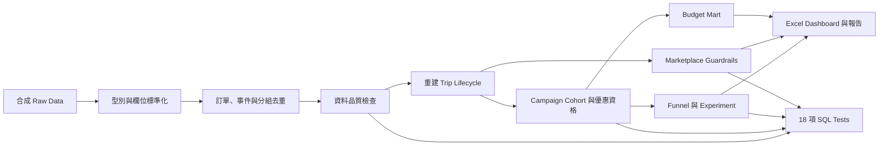

# 專案工作分析報告

## From Dirty Ride Data to Operations Decisions

### 桃園機場旅遊合作叫車活動：從專案構思、SQL 分析到營運結論

> 專案性質：大學個人資料分析專題／面試作品集  
> 目標職務：Uber Taiwan Mobility Operations Specialist  
> 資料性質：完全合成，不包含真實乘客、司機或 Uber 內部資料  
> 分析期間：2025-09-01 至 2025-10-26，另保留 7 天合法優惠兌換觀察期

---

## 執行摘要

本專案模擬 Uber Taiwan 與旅遊平台合作，在旅客抵達桃園機場前透過 CRM 提供叫車優惠，希望同時增加「機場首趟行程」與「抵台後的當地回訪行程」。專案並未只比較優惠券兌換量，而是把資料品質、受眾資格、活動增量、七日貢獻、機場供需、接車時間、取消率與預算放在同一個營運決策中。

分析從 52,222 筆原始叫車訂單開始。資料經過格式標準化、重複資料排除、行程事件生命週期重建、座標與付款檢查後，保留 48,347 筆可信行程，並建立 6,824 位符合活動資格的唯一使用者。SQL Pipeline 最後產出 Campaign、Experiment、Marketplace、Budget 與 Data Quality Marts，供 Excel Dashboard 與結案報告使用。

主要結果如下：

- Airport 150 將機場完成率由 Control 的 16.4% 提升至 25.1%，增量為 8.7 個百分點，95% 信賴區間為 5.5 至 11.9 個百分點。
- Bundle 100+100 的機場完成率為 23.5%，D7 當地回訪率為 8.3%，是三組中最高。
- Airport 150 與 Bundle 100+100 的七日增量貢獻分別為 -NT$42,480 與 -NT$25,592，代表增加的行程價值仍不足以負擔補貼成本。
- 有效優惠總支出為 NT$208,900，超過 NT$150,000 預算，預算使用率為 139.3%。
- TPE Airport 的活動期平均 P90 接車 ETA 相較基準期增加 15.0%，超過 +10% Guardrail；Ximending 的取消率增加 1.7 個百分點，也超過 +1 個百分點門檻。

因此，最後判斷不是「活動沒有作用」，而是「活動能增加行程，但目前的補貼設計與 Marketplace 條件不適合全面擴量」。建議保留 Control，降低 Bundle 第二趟優惠、爭取合作夥伴共同出資，並依機場 ETA、取消率及預算節奏控制 CRM 發送。

---

## 1. 專案構思

### 1.1 為什麼選擇這個題目

目標職務同時要求 Partnership execution、Campaign design、SQL、Dashboard、Marketplace management 與跨部門執行。因此，專題不能只做一般的行程量趨勢圖，也不能只展示幾段查詢語法；它必須呈現一個 Operations Specialist 如何從模糊問題建立分析架構，再把結果轉成可執行的營運決策。

本專案選擇「桃園機場旅遊合作」作為情境，原因有三個：

1. 機場旅客有明確的抵達時間與合作夥伴資料，可展示受眾圈選與 CRM 時序管理。
2. 機場需求集中且容易受供給限制，可同時展示行銷活動與 Marketplace 品質之間的取捨。
3. 單次機場優惠與兩段式優惠代表不同商業目的，適合比較首次轉換、回訪與補貼成本。

### 1.2 核心商業問題

> 在固定八週預算下，應該向抵達桃園機場的旅客提供單次機場優惠，還是提供「機場＋當地回訪」兩段式優惠，才能產生真正的增量行程與貢獻，同時不傷害接車服務品質？

這個問題被拆成五個可分析的子問題：

1. 哪些旅客符合作為活動受眾的資格？
2. 兩種優惠是否真的比 Control 增加機場完成行程？
3. Bundle 是否能增加七日內的當地回訪？
4. 增加的行程價值能否負擔優惠成本？
5. 活動期間的機場 ETA、取消率與供需是否仍在可接受範圍？

### 1.3 專案成功的定義

方案只有在下列條件同時成立時，才會被建議擴量：

- 機場轉換率增量的 95% 信賴區間排除 0。
- 完整七日增量貢獻為正。
- P90 接車 ETA 相較基準期增加不超過 10%。
- 取消率相較基準期增加不超過 1 個百分點。
- 優惠支出沒有超過預算，且每日支出未高於按日計畫 15%。

---

## 2. 假設業務情境

### 2.1 合作與活動設定

本專案假設 Uber Taiwan 與虛構旅遊平台 `Travel Partner X` 合作。平台提供旅客的抵台訂位資訊，Uber 依資料使用同意與活動資格，在旅客抵達前發送 CRM，並將使用者隨機分配到三個實驗組別。

| 項目 | 假設設定 |
|---|---|
| 活動名稱 | TPE Arrival to Local |
| 活動期間 | 2025-09-01 至 2025-10-26 |
| 合作夥伴 | Travel Partner X（虛構） |
| 目標人數 | 18,000 位有抵台訂位的旅客 |
| Control 配比 | 10% |
| Airport 150 配比 | 45% |
| Bundle 100+100 配比 | 45% |
| 歸因期間 | 抵達後 7 天 |
| 歷史行程排除 | 指派前 180 天內不得有台灣完成行程 |
| 活動預算 | NT$150,000 |
| 預算告警 | 累積支出高於按日計畫 15% |
| Marketplace 基準期 | 活動前 28 天 |

### 2.2 實驗組別

| 組別 | 優惠設計 | 商業目的 |
|---|---|---|
| Control | 只提供旅遊與叫車資訊 | 建立未補貼基準 |
| Airport 150 | 第一趟合格機場行程折抵 NT$150 | 提高首次機場叫車轉換 |
| Bundle 100+100 | 第一趟機場行程折抵 NT$100；其後 7 天內一趟當地行程再折抵 NT$100 | 同時提高機場轉換與當地回訪 |

### 2.3 受眾資格假設

使用者必須同時符合以下條件：

1. 活動期間有一筆已確認的抵台訂位；同一使用者有多筆時，使用最早的一筆活動訂位。
2. 已同意接收 CRM，且不在 Fraud exclusion 名單。
3. Campaign assignment 發生在活動期間，並早於旅客抵達。
4. CRM sent 發生在 assignment 之後、arrival 之前。
5. Assignment 前 180 天內沒有台灣完成行程。
6. 同一使用者只保留一筆活動 Cohort 紀錄。

### 2.4 專案邊界

這是分析方法與營運推理的展示，不是對 Uber 真實績效的推估。所有轉換率、成本、ETA、供需與旅客行為都是依固定亂數種子產生的合成結果；它們可用來驗證資料處理與決策流程，但不能解讀為真實市場表現。

---

## 3. 資料設計與真實性

### 3.1 原始資料表

| 原始資料表 | 資料粒度 | 分析用途 |
|---|---|---|
| `raw_users` | 每位使用者一筆 Profile | CRM 同意、語言、Fraud exclusion |
| `raw_drivers` | 每位司機一筆 Profile | 司機外鍵與機場資格 |
| `raw_partner_bookings` | 每筆旅遊訂位 | 抵達時間、來源市場、航廈 |
| `raw_trip_orders` | 每次叫車建立紀錄 | 使用者、司機、地點、車資、終態 |
| `raw_trip_events` | 每筆行程事件 | Requested、Accepted、Picked up、Completed、Cancelled |
| `raw_payments` | 每筆付款事件 | Charge、Refund、付款金額與狀態 |
| `raw_campaign_assignments` | 每次活動分組 | 實驗組別與指派時間 |
| `raw_promo_redemptions` | 每次優惠套用 | 優惠碼、使用者、行程與折抵金額 |
| `raw_crm_events` | 每筆 CRM 事件 | Sent、Opened、Clicked 與時序 |
| `raw_supply_hourly` | 每個區域／小時 | 司機數、需求量、完成行程量 |

### 3.2 刻意加入的無效資料

真實叫車環境不會只有乾淨且完整的行程資料，因此合成器刻意注入下列問題：

| 無效資料類型 | 注入規模 | 營運風險 | 處理方式 |
|---|---:|---|---|
| 重複 Trip order | 619 | 重複計算行程與營收 | 保留最早入倉版本 |
| 重複 Trip event | 7,269 | 事件數與生命週期錯誤 | 依 Trip、事件類型與時間去重 |
| 生命週期順序錯置 | 558 | 完成率與 ETA 不可信 | Quarantine 整筆行程 |
| 無效或未來時間 | 1,996 | 活動歸因錯誤 | 無法解析或超出合理範圍者隔離 |
| 無效座標 | 522 | 機場與區域判斷錯誤 | 超出台灣範圍或空值者隔離 |
| Orphan foreign key | 208 | 找不到使用者或司機 | 隔離受影響行程 |
| 財務完整性問題 | 365 | 車資與付款高估 | 負車資或付款高於車資者隔離 |
| Campaign integrity | 108 | Control 誤發優惠或錯誤歸因 | 拒絕無效優惠，不刪除原行程 |
| Late-arriving event | 4,991 | 即時 Dashboard 與最終結果不同 | 保留並標記 Warning |
| CRM opt-out send | 78 | 同意與法遵風險 | 不納入活動證據 |

原始資料不會被直接覆寫。SQL 只建立標準化、去重、隔離與分析層，讓每個問題都能在 `trip_quality_issues` 與 Data Quality Mart 中追蹤。

---

## 4. 主要分析工作過程



### 4.1 第一階段：定義問題與決策門檻

先將模糊的「旅遊合作活動有沒有成效」改寫成受眾、轉換、回訪、七日貢獻、Marketplace 與預算六類指標。這一步確保後續 SQL 不是先看到資料再挑結果，而是預先知道什麼條件才允許擴量。

### 4.2 第二階段：建立可重現的合成資料

`src/generate_synthetic_data.py` 使用 `config.json` 的活動期間、配比、歸因窗與固定亂數種子產生資料。相同設定會得到相同結果，方便面試官重跑與核對。

### 4.3 第三階段：建立可信 Trip Lifecycle

叫車訂單的 `terminal_status` 不能直接視為真實結果，因此使用 Trip events 重建 Requested、Accepted、Driver arrived、Picked up、Completed 與 Cancelled 時間。只有通過順序、座標、外鍵、車資、付款與速度檢查的行程，才會被標示為 `valid_for_trip_kpi = true`。

### 4.4 第四階段：建立活動受眾與優惠資格

Cohort 不只依 Assignment 表圈選。SQL 同時檢查 Partner booking、CRM consent、Fraud exclusion、Assignment／CRM／Arrival 時序、180 天歷史行程與重複訂位。

優惠也不因為出現在 Redemption 表就直接算成本。SQL 會確認 Redemption user 與 Trip user 相同、Assignment 早於 Trip request、優惠碼符合實驗組別、Airport reward 只用在首趟機場行程，以及 `LOCAL100` 只用在後續七日內的當地行程。

### 4.5 第五階段：用 Intent-to-Treat 評估活動

所有已分配的合格使用者都保留在原組別分母，即使沒有開信、叫車或使用優惠。這可避免只分析 Redemption users 所造成的選擇偏差。

### 4.6 第六階段：把活動結果連回營運限制

活動成效與 Marketplace、Budget 分開計算但一起判斷。即使轉換顯著，如果增量貢獻為負、ETA 越界或預算超支，Operations 仍不應全面擴量。

### 4.7 第七階段：測試、Dashboard 與結案

Pipeline 執行後會跑 18 項 SQL assertions。通過後才輸出 CSV Marts、Excel Dashboard、繁中報告、PDF 與英文摘要；最後再以獨立 QA 檢查資料流與結論一致性。

---

## 5. SQL 分析步驟與指令

### 5.1 SQL 執行方式

專案使用 DuckDB。`src/run_pipeline.py` 會依檔名順序執行 `sql/00` 至 `sql/09`，並把 `config.json` 中的活動名稱、日期、歸因天數、預算等參數注入 SQL。

完整執行指令：

```powershell
# 安裝 Python 與 Dashboard 依賴
python -m pip install -r requirements.txt
npm install

# 產生固定種子的合成資料
python src/generate_synthetic_data.py --mode sample

# 執行全部 SQL、18 項測試並輸出分析 Marts
python src/run_pipeline.py

# 產生 Excel Dashboard
node src/build_dashboard.mjs

# 產生繁中報告、PDF 與英文摘要
python src/build_report.py
```

也可直接執行：

```powershell
.\run_project.ps1
```

### 5.2 Step 00：載入 Raw CSV

目的：保留原始資料型態與內容，不在載入時靜默修正問題。容易髒掉的 Trip、Event、Payment、Campaign 欄位先以字串載入，後續再用 `try_cast` 判斷。

```sql
CREATE OR REPLACE TABLE raw_trip_orders AS
SELECT *
FROM read_csv_auto(
  '{{RAW_DIR}}/raw_trip_orders.csv',
  header = true,
  all_varchar = true
);

CREATE OR REPLACE TABLE raw_trip_events AS
SELECT *
FROM read_csv_auto(
  '{{RAW_DIR}}/raw_trip_events.csv',
  header = true,
  all_varchar = true
);
```

完整檔案：[sql/00_load_raw.sql](../sql/00_load_raw.sql)

### 5.3 Step 01：欄位標準化與安全轉型

目的：清除前後空白、統一大小寫，並使用 `try_cast` 將無法解析的值轉為 `NULL`，避免整個 Pipeline 因單一錯誤值停止。

```sql
CREATE OR REPLACE TABLE stg_trip_orders AS
SELECT
  trim(trip_id) AS trip_id,
  trim(user_id) AS user_id,
  nullif(trim(driver_id), '') AS driver_id,
  try_cast(requested_at AS TIMESTAMPTZ) AS requested_at,
  try_cast(pickup_lat AS DOUBLE) AS pickup_lat,
  try_cast(pickup_lng AS DOUBLE) AS pickup_lng,
  try_cast(gross_fare_twd AS DOUBLE) AS gross_fare_twd,
  lower(trim(terminal_status)) AS terminal_status
FROM raw_trip_orders;
```

完整檔案：[sql/01_standardize_raw_data.sql](../sql/01_standardize_raw_data.sql)

### 5.4 Step 02：排除重複資料

目的：在不刪除 Raw data 的前提下，依入倉時間保留最早版本。Trip events 以 `trip_id + event_type + event_at` 判斷是否為同一事件。

```sql
CREATE OR REPLACE TABLE stg_trip_orders_dedup AS
SELECT * EXCLUDE (row_num),
  CASE
    WHEN row_num = 1 THEN 'kept'
    ELSE 'duplicate_excluded'
  END AS record_disposition
FROM (
  SELECT *,
    row_number() OVER (
      PARTITION BY trip_id
      ORDER BY ingested_at NULLS LAST
    ) AS row_num
  FROM stg_trip_orders
);
```

完整檔案：[sql/02_deduplicate.sql](../sql/02_deduplicate.sql)

### 5.5 Step 03：建立資料品質問題表

目的：把無效座標、空時間、Orphan user／driver、負車資、未來事件與付款異常記錄成可追蹤的 Issue，而不是直接把資料丟掉。

```sql
CREATE OR REPLACE TABLE trip_quality_issues AS
SELECT
  trip_id,
  'invalid_coordinates' AS issue_code,
  'hard_invalid' AS severity,
  'quarantined' AS disposition
FROM stg_trip_orders_dedup
WHERE record_disposition = 'kept'
  AND (
    pickup_lat IS NULL
    OR pickup_lng IS NULL
    OR pickup_lat NOT BETWEEN 21.5 AND 25.5
    OR pickup_lng NOT BETWEEN 119.0 AND 122.5
  );
```

完整檔案：[sql/03_quality_checks.sql](../sql/03_quality_checks.sql)

### 5.6 Step 04：重建 Trip Lifecycle

目的：依事件時間重建每趟行程，並檢查事件是否逆序。Completed 必須在 Picked up 之後；Cancelled 必須在 Requested 之後且不能發生在 Picked up 之後。

```sql
CREATE OR REPLACE TABLE int_trip_event_pivot AS
SELECT
  trip_id,
  min(event_at) FILTER (WHERE event_type = 'requested') AS requested_event_at,
  min(event_at) FILTER (WHERE event_type = 'accepted') AS accepted_at,
  min(event_at) FILTER (WHERE event_type = 'picked_up') AS picked_up_at,
  min(event_at) FILTER (WHERE event_type = 'completed') AS completed_at,
  min(event_at) FILTER (WHERE event_type = 'cancelled') AS cancelled_at
FROM stg_trip_events_dedup
WHERE record_disposition = 'kept'
GROUP BY trip_id;
```

只有沒有 `hard_invalid` Issue 的行程才進入可信 KPI：

```sql
WITH hard_invalid AS (
  SELECT DISTINCT trip_id
  FROM trip_quality_issues
  WHERE severity = 'hard_invalid'
)
SELECT
  o.trip_id,
  o.user_id,
  CASE WHEN hi.trip_id IS NULL THEN true ELSE false END AS valid_for_trip_kpi,
  CASE WHEN hi.trip_id IS NULL THEN 'kept' ELSE 'quarantined' END AS record_disposition
FROM stg_trip_orders_dedup o
LEFT JOIN hard_invalid hi USING (trip_id);
```

完整檔案：[sql/04_trip_lifecycle.sql](../sql/04_trip_lifecycle.sql)

### 5.7 Step 05：建立 Campaign Cohort

目的：產生一人一列、時序正確且具 CRM 同意的活動受眾。多筆 Booking 先以 `row_number()` 選擇最早活動訂位，再驗證 Assignment、CRM sent 與 Arrival 的順序。

```sql
WITH eligible_bookings AS (
  SELECT
    b.*,
    row_number() OVER (
      PARTITION BY b.user_id
      ORDER BY b.arrival_at, b.booking_id
    ) AS booking_rank
  FROM stg_partner_bookings b
  WHERE b.booking_status = 'confirmed'
), cohort AS (
  SELECT a.user_id, a.experiment_arm, a.assigned_at, b.arrival_at
  FROM stg_campaign_assignments_dedup a
  JOIN eligible_bookings b
    ON a.user_id = b.user_id
   AND b.booking_rank = 1
  JOIN stg_users u
    ON a.user_id = u.user_id
  WHERE u.crm_opt_in
    AND NOT u.fraud_exclusion
    AND a.assigned_at <= b.arrival_at
    AND EXISTS (
      SELECT 1
      FROM stg_crm_events crm
      WHERE crm.user_id = a.user_id
        AND crm.crm_event_type = 'sent'
        AND crm.event_at BETWEEN a.assigned_at AND b.arrival_at
    )
)
SELECT * FROM cohort;
```

SQL 另以 `NOT EXISTS` 排除 Assignment 前 180 天內已有台灣完成行程的使用者。

完整檔案：[sql/05_campaign_cohort.sql](../sql/05_campaign_cohort.sql)

### 5.8 Step 06：驗證優惠資格

目的：避免把不應由活動負擔的優惠算入成本。核心判斷包括：

- Trip user 必須等於 Redemption user。
- Assignment 必須早於 Trip request。
- Control 不得有有效優惠。
- `TPE150` 只能屬於 Airport 150。
- `TPE100`、`LOCAL100` 只能屬於 Bundle。
- Airport reward 必須是抵達後的第一趟合格機場行程。
- `LOCAL100` 必須用於第一趟機場行程後七日內的當地行程。

```sql
CASE
  WHEN f.user_id <> r.user_id
    THEN 'rejected_trip_user_mismatch'
  WHEN a.assigned_at > f.requested_at
    THEN 'rejected_assignment_after_trip_request'
  WHEN a.experiment_arm = 'control'
    THEN 'rejected_control_reward'
  WHEN a.experiment_arm = 'airport_150'
    AND r.promo_code <> 'TPE150'
    THEN 'rejected_promo_arm_mismatch'
  WHEN r.promo_code = 'LOCAL100'
    AND f.is_airport_trip
    THEN 'rejected_local_reward_ineligible'
  ELSE 'valid'
END AS redemption_disposition
```

完整邏輯同樣位於：[sql/04_trip_lifecycle.sql](../sql/04_trip_lifecycle.sql)

### 5.9 Step 07：建立 Funnel 與 D7 當地回訪

目的：把使用者由 Assignment、CRM、Airport request、Airport completed 追蹤到七日內的 Local repeat。Funnel 只使用清洗後 Cohort 與可信行程。

```sql
EXISTS (
  SELECT 1
  FROM fct_trip_lifecycle f
  WHERE f.user_id = c.user_id
    AND f.valid_for_trip_kpi
    AND f.lifecycle_status = 'completed'
    AND NOT f.is_airport_trip
    AND f.requested_at > first_airport_requested_at
    AND f.requested_at <= first_airport_requested_at + INTERVAL '7 days'
) AS completed_repeat_trip
```

完整檔案：[sql/06_campaign_funnel.sql](../sql/06_campaign_funnel.sql)

### 5.10 Step 08：計算 Experiment 增量

目的：以 Intent-to-Treat 分母比較 Treatment 與 Control，不只計算轉換率，也計算七日完成行程與完整七日淨貢獻。

主要公式：

```text
Airport conversion = Airport completed users / Assigned users
D7 local repeat rate = Local repeat users / Assigned users
Incremental conversion = Treatment conversion - Control conversion
Incremental completed trips = Incremental conversion × Treatment assigned users
Incremental contribution =
  (Treatment 七日平均淨貢獻／Assigned user
   - Control 七日平均淨貢獻／Assigned user)
  × Treatment assigned users
```

95% 信賴區間的 SQL：

```sql
(treatment_rate - control_rate)
- 1.96 * sqrt(
    treatment_rate * (1 - treatment_rate) / treatment_n
    + control_rate * (1 - control_rate) / control_n
  ) AS incremental_conversion_ci_low
```

完整檔案：[sql/07_experiment_results.sql](../sql/07_experiment_results.sql)

### 5.11 Step 09：Marketplace Guardrails

目的：比較活動期與活動前 28 天的服務品質，避免活動增加需求後傷害接車體驗。

Zone-hour 沒有可信 Trip 時會標示為 `source_only_no_observed_trip`，不會把接單率或取消率錯算成 0%。

```sql
CASE
  WHEN t.observed_requests IS NULL
    THEN 'source_only_no_observed_trip'
  ELSE 'observed'
END AS metric_observation_status,

CASE
  WHEN t.observed_requests > 0
    THEN t.accepted_requests::DOUBLE / t.observed_requests
END AS acceptance_rate
```

Guardrail 判斷：

```sql
CASE
  WHEN campaign_p90_eta / baseline_p90_eta - 1 > 0.10
    OR campaign_cancellation_rate - baseline_cancellation_rate > 0.01
  THEN 'guardrail_breach'
  ELSE 'pass'
END AS guardrail_status
```

完整檔案：[sql/08_marketplace_health.sql](../sql/08_marketplace_health.sql)

### 5.12 Step 10：預算與資料對帳

目的：將 Cohort 的所有有效優惠列入活動責任，包含活動最後一天抵達旅客在其後七日合法使用的優惠。

```sql
SELECT
  CAST(r.redeemed_at AS DATE) AS campaign_date,
  sum(r.discount_twd) AS daily_spend_twd
FROM fct_valid_redemptions r
JOIN mart_campaign_cohort c
  ON r.user_id = c.user_id
WHERE r.redemption_disposition = 'valid'
GROUP BY 1;
```

預算狀態：

```sql
CASE
  WHEN cumulative_spend_twd > budget_twd
    THEN 'alert_over_budget'
  WHEN cumulative_spend_twd > planned_cumulative_spend_twd * 1.15
    THEN 'alert_over_pace'
  ELSE 'on_track'
END AS budget_status
```

完整檔案：[sql/09_quality_and_reconciliation.sql](../sql/09_quality_and_reconciliation.sql)

### 5.13 Step 11：SQL Assertions

每項測試回傳 `failed_rows`；只要任何值大於 0，Python Pipeline 立即停止，不會繼續輸出 Dashboard 決策資料。

代表性測試：

```sql
SELECT
  'cohort_has_one_row_per_user' AS test_name,
  count(*) AS failed_rows
FROM (
  SELECT user_id
  FROM mart_campaign_cohort
  GROUP BY user_id
  HAVING count(*) > 1
);
```

```sql
SELECT
  'valid_reward_assignment_precedes_trip_request' AS test_name,
  count(*) AS failed_rows
FROM fct_valid_redemptions r
JOIN fct_trip_lifecycle f USING (trip_id)
WHERE r.redemption_disposition = 'valid'
  AND r.assigned_at > f.requested_at;
```

測試檔案：

- [tests/01_trip_lifecycle.sql](../tests/01_trip_lifecycle.sql)
- [tests/02_campaign_integrity.sql](../tests/02_campaign_integrity.sql)
- [tests/03_mart_integrity.sql](../tests/03_mart_integrity.sql)

---

## 6. 分析結果

### 6.1 資料清洗結果

| Pipeline 階段 | 筆數 |
|---|---:|
| Raw Trip order rows | 52,222 |
| 去重後 Trip order rows | 51,603 |
| 可信 Trip lifecycle rows | 48,347 |
| 最終 Campaign cohort users | 6,824 |

| 資料問題 | 受影響行程 | 處置 |
|---|---:|---|
| 無效／未來 Event time | 1,968 | Quarantined |
| Event step 逆序 | 1,819 | Quarantined |
| Lifecycle sequence 無效 | 1,424 | Quarantined |
| 無效座標 | 513 | Quarantined |
| 付款高於車資 | 304 | Quarantined |
| 負車資 | 178 | Quarantined |
| Orphan user | 104 | Quarantined |
| Orphan driver | 104 | Quarantined |
| 不合理平均速度 | 25 | Quarantined |
| Late-arriving event | 4,522 | Kept with warning |

清洗前完成行程車資為 NT$21,979,956，可信車資為 NT$20,505,068，相差 NT$1,474,888。若直接使用 Raw data，活動財務結果會被高估。

### 6.2 Campaign 與 Experiment 結果

| 指標 | Control | Airport 150 | Bundle 100+100 |
|---|---:|---:|---:|
| Assigned users | 683 | 3,053 | 3,088 |
| Airport completed users | 112 | 766 | 725 |
| Airport conversion | 16.4% | 25.1% | 23.5% |
| Incremental conversion | - | +8.7 個百分點 | +7.1 個百分點 |
| 95% CI | - | +5.5 至 +11.9 個百分點 | +3.9 至 +10.2 個百分點 |
| D7 local repeat users | 19 | 152 | 256 |
| D7 local repeat rate | 2.8% | 5.0% | 8.3% |
| Incremental 7-day completed trips | - | 329.9 | 397.4 |
| Reward cost | NT$0 | NT$112,500 | NT$96,400 |
| Cost per incremental airport trip | - | NT$424 | NT$441 |
| Incremental contribution | - | -NT$42,480 | -NT$25,592 |

### 6.3 Marketplace 結果

| 區域 | ETA 相較基準期 | 取消率相較基準期 | 判斷 |
|---|---:|---:|---|
| TPE Airport | +15.0% | +0.6 個百分點 | Guardrail breach |
| Taipei 101 | -1.7% | -0.7 個百分點 | Pass |
| Taipei Main | -3.4% | -1.1 個百分點 | Pass |
| Ximending | +1.4% | +1.7 個百分點 | Guardrail breach |

TPE Airport 的主要風險是 ETA，表示活動帶來的機場需求可能超過尖峰供給能力。Ximending 的主要風險是取消率，需進一步拆解司機取消、乘客取消、上車點指引與付款問題。

### 6.4 預算結果

| 項目 | 結果 |
|---|---:|
| 活動預算 | NT$150,000 |
| 有效優惠支出 | NT$208,900 |
| 預算使用率 | 139.3% |
| 超支金額 | NT$58,900 |
| 最終狀態 | `alert_over_budget` |

Funnel 的有效優惠成本與 Budget Mart 最終支出同為 NT$208,900，代表活動成效與財務責任已完成對帳。

---

## 7. 商業分析判斷

### 7.1 為什麼不能只看轉換率

兩個 Treatment 的機場轉換增量皆為正，且信賴區間排除 0。如果只看到這裡，可能會得出「應該擴量」的結論；但 Operations 決策還必須回答三件事：增加的行程是否有足夠價值、Marketplace 能否承受需求、預算是否可控。

本案中三項限制都沒有通過：

1. 兩個方案的七日增量貢獻皆為負。
2. TPE Airport 的 ETA 增加 15.0%，超過 +10% Guardrail。
3. 優惠支出超過預算 NT$58,900。

因此，顯著的轉換增量只能證明優惠有效刺激需求，不能證明目前方案值得全面擴量。

### 7.2 Airport 150 的判斷

Airport 150 的機場轉換增量最高，表示較高的首趟折抵確實能降低旅客第一次使用的門檻。但它的 Reward cost 為 NT$112,500，Cost per incremental airport trip 約 NT$424，最終增量貢獻為 -NT$42,480。

營運判斷：保留作為高價值客群或供給充足時段的精準方案，不適合對全部旅客發送。

### 7.3 Bundle 100+100 的判斷

Bundle 的機場轉換增量略低於 Airport 150，但 D7 當地回訪率最高，證明第二趟優惠比較符合「抵台後建立當地使用習慣」的目的。它的增量貢獻雖仍為負，但 -NT$25,592 優於 Airport 150。

營運判斷：Bundle 較值得進入下一輪實驗，但應降低第二趟金額、設定最低車資或由合作夥伴共同負擔成本。

### 7.4 Marketplace 判斷

活動不應在 TPE Airport 尖峰時段無限制擴大。當 P90 ETA 高於基準期 10% 時，Operations 應暫停新增 CRM 發送、增加合格機場司機供給、縮小優惠時段，或限制航班集中抵達的高壓區間。

### 7.5 最終決策

| 決策項目 | 結論 |
|---|---|
| 全面擴量 | 不建議 |
| Airport 150 | 保留為精準客群／非尖峰測試方案 |
| Bundle 100+100 | 重新設計後進行下一輪實驗 |
| Control | 必須保留，持續量測真正增量 |
| CRM | 依 ETA、取消率與預算節奏動態控量 |
| Partner negotiation | 爭取共同出資或按完成行程分攤 |
| Marketplace | 機場尖峰需先補供給，再增加需求 |

---

## 8. 專案工作成果與證明

這份專案的每個主要主張都有可檢查的程式、輸出或文件作為證據。

| 要證明的能力／工作 | 專案證據 |
|---|---|
| 從模糊問題建立分析架構 | [Campaign brief](../docs/campaign_brief.md)、[Metric definitions](../docs/metric_definitions.md) |
| 設計真實營運髒資料 | [Synthetic data generator](../src/generate_synthetic_data.py)、[Dirty data manifest](../data/metadata/dirty_data_manifest.csv) |
| 建立資料模型與粒度 | [Data model](../docs/data_model.md)、[Data dictionary](../data/metadata/data_dictionary.csv) |
| 使用 SQL 清洗與重建行程 | [sql/00 至 sql/04](../sql/) |
| 用 SQL 圈選受眾與驗證優惠 | [sql/05_campaign_cohort.sql](../sql/05_campaign_cohort.sql)、[sql/04_trip_lifecycle.sql](../sql/04_trip_lifecycle.sql) |
| 量測活動增量與商業價值 | [sql/07_experiment_results.sql](../sql/07_experiment_results.sql)、[Experiment output](../outputs/data/mart_experiment_results.csv) |
| 管理 Marketplace 與預算 | [Marketplace SQL](../sql/08_marketplace_health.sql)、[Budget SQL](../sql/09_quality_and_reconciliation.sql) |
| 建立可供營運使用的 Dashboard | [Excel Dashboard](../dashboard/airport_campaign_dashboard.xlsx)、[Preview](../dashboard/screenshots/dashboard_preview.png) |
| 建立可重跑的品質檢查 | [18 項 SQL test results](../outputs/test_results.json) |
| 將分析轉成跨部門執行 | [Launch checklist](../docs/launch_checklist.md)、[Monitoring playbook](../docs/monitoring_playbook.md) |
| 完成結案與限制說明 | [完整結案報告](final_report.md)、[Postmortem](../docs/postmortem.md) |

專案的主要工作過程可歸納為：

1. 解讀目標職務，選定能同時展示 Partnership、Campaign、SQL 與 Marketplace 的題目。
2. 定義業務問題、成功指標、Guardrails 與實驗組別。
3. 設計資料模型與叫車環境常見的無效資料。
4. 產生可重現的合成資料與資料品質 Manifest。
5. 建立 SQL Pipeline，從 Raw data 產出可信 Facts 與 Decision Marts。
6. 建立 SQL Assertions，逐步修正 Cohort、優惠、預算及 Marketplace 分母問題。
7. 產出 Excel Dashboard、完整報告、英文摘要與跨部門執行文件。
8. 進行獨立 QA，確認資料流、數字、商業判斷與文件一致。

---

## 9. 限制與下一步

### 9.1 目前限制

- 所有資料為合成資料，不能代表真實 Uber Taiwan 的需求或財務結果。
- 本案使用簡化的 30% Gross fare contribution 假設，未拆解司機付款、保險、客服與 Partner fee。
- 信賴區間使用常態近似，正式實驗應先做 Power analysis，並依實際樣本量選擇方法。
- Marketplace 使用區域／小時層級，未納入天候、航班延誤、道路事件及 Driver incentive。
- 尚未分析旅客來源市場、語言、抵達航廈與時段的異質效果。

### 9.2 下一輪建議

1. 測試較低的 Bundle 第二趟優惠，例如 NT$50 或滿額折抵。
2. 導入 Partner co-funding，降低 Uber 單方補貼成本。
3. 先依來源市場、抵達時段與預估價值建立分層，再進行隨機實驗。
4. 加入 Power analysis 與預先註冊的主要指標，避免事後挑選結果。
5. 將 CRM 發送與即時 Marketplace Guardrail 串接，ETA 或取消率越界時自動停止新增發送。
6. 加入退款、客服案件、付款失敗、Driver incentive 與 Support contact 成本。

---

## 10. 結論

本專案證明了一套完整的 Operations 分析工作方式：先把模糊合作問題轉成可驗證的商業問題，建立貼近叫車現場的髒資料，使用 SQL 建立可信 Trip Lifecycle、活動 Cohort、優惠資格、Experiment、Marketplace 與 Budget Marts，再用測試、Dashboard 與跨部門文件把分析結果轉成決策。

分析證明兩種優惠都能增加機場完成行程，Bundle 也能提高七日當地回訪；但完整七日增量貢獻為負、TPE Airport ETA 越界，且優惠預算超支。因此最合理的結論不是直接停止旅遊合作，也不是因轉換率上升就全面擴量，而是保留 Control、重新設計 Bundle 成本、爭取 Partner funding，並讓 CRM 需求成長服從 Marketplace 與 Budget Guardrails。

這份結論同時回答了「活動是否有效」、「活動是否值得擴量」及「下一步應如何執行」三個層次，並透過可重跑 SQL、18 項測試、分析輸出與營運文件留下完整證據。

---

## 附錄：主要專案入口

- [專案首頁](../README_zh-TW.md)
- [完整結案報告](final_report.md)
- [英文摘要](executive_summary_en.md)
- [Excel Dashboard](../dashboard/airport_campaign_dashboard.xlsx)
- [SQL 目錄](../sql/)
- [測試結果](../outputs/test_results.json)
- [資料清洗規則](../docs/cleaning_rules.md)
- [指標定義](../docs/metric_definitions.md)
- [資料來源與限制](../docs/sources.md)
